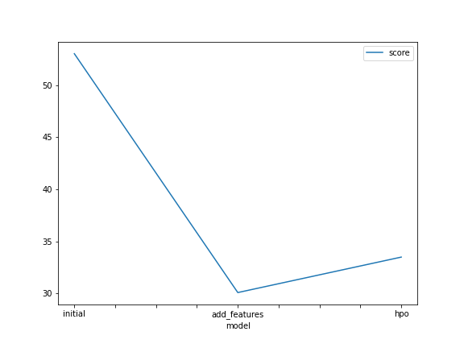
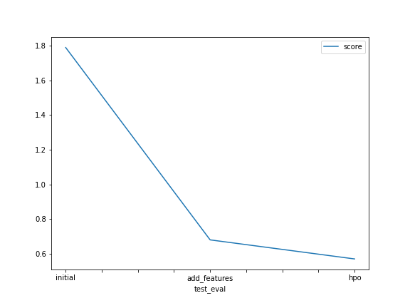

# Report: Predict Bike Sharing Demand with AutoGluon Solution
#### Ramzi El Halabi

## Initial Training
### What did you realize when you tried to submit your predictions? What changes were needed to the output of the predictor to submit your results?
When I tried to submit my predictions using the raw model outputs, negative predictions were causing submission rejection. As a solution, I converted all negative predictions to null values and successfully resubmitted the prediction results. 

### What was the top ranked model that performed?
The 'WeightedEnsemble_L3' model performed best.

## Exploratory data analysis and feature creation
### What did the exploratory analysis find and how did you add additional features?
By performing EDA, I was able to investigate the statistical distribution of each feature, which informed me about the discriminatory power of each feature (uniform distributions are the least discriminatory and have do not add any insight to be used by our prediction model), the level of outliers/anomalies, and the feature types (e.g., continuous, discrete, categorical). Most features were insufficiently informative, which indicated the need for additional feature extraction, and for feature engineering (converting the 'season' and 'weather' features to categorical variables).
I performed additional feature extraction by making use of the date.time functions provided in Pandas; I extracted the year, month, day, hour, and more date.time-related features from the datetime feature. This allowed the model to perform in-depth temporal feature analysis with the target variable.

### How much better did your model preform after adding additional features and why do you think that is?
My model performed significantly better upon feature addition. In fact, the RMSE decreased from 53.0 to 30.1 (76% improvement). This decrease in RMSE is due to the addition of relevant target-predictive features which were used by the model to produce more accurate predictions.

## Hyper parameter tuning
### How much better did your model preform after trying different hyper parameters?
After trying different hyperparameters combinations, the model was inconsistently varying based on the number and types varied hyperparameters. Although the RMSE of the model slightly increased from 30.1 to 33.5, the overall Kaggle score improved from 0.68 to 0.57.

### If you were given more time with this dataset, where do you think you would spend more time?
If I was given more time with this dataset, I would spend more time performing feature extraction and selection, and finding the best hyperparameter combination that yields the lowest RMSE.

### Create a table with the models you ran, the hyperparameters modified, and the kaggle score.
|model|hpo1|hpo2|hpo3|score|
|--|--|--|--|--|
|initial|default_vals|default_vals|default_vals|1.79|
|add_features|default_vals|default_vals|default_vals|0.68|
|hpo|default_vals|default_vals|default_vals|0.57|

### Create a line plot showing the top model score for the three (or more) training runs during the project.

### Create a line plot showing the top kaggle score for the three (or more) prediction submissions during the project.

## Summary
To predict the bike sharing demand based on temporal (e.g. date, season) and environmental (e.g. temperature, humidity), we implemented an AutoML approach using Autogluon on AWS SageMaker. First, we comparatively performed regression on the raw features across different ML algorithms and used the model which yielded the lowest prediction error. Second, we performed exploratory data analysis on our raw data to have a deeper understanding of feature distribution and data quality, allowing us to have a clearer image of the discriminatory power and contribution level of each feature on the target variable. This analyis showed that we needed more features; we extracted more datetime features that imporoved the overall accuracy of the predictive model. Last, we performed hyperparameter tuning to assess the effect of the internal configuration of our model on its predictive power, which yielded a higher overall prediction score. We concluded that feature engineering and hyperparameter tuning are 2 effective techniques for ML model performance improvement. 
